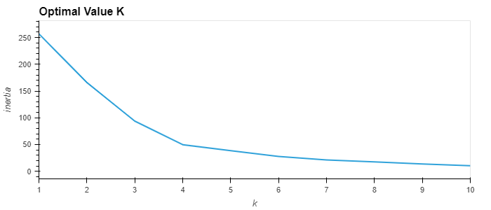
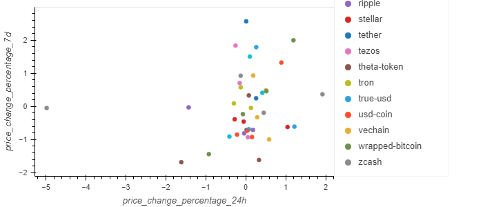
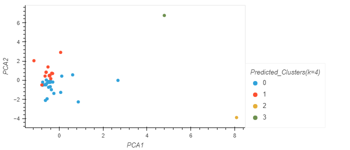
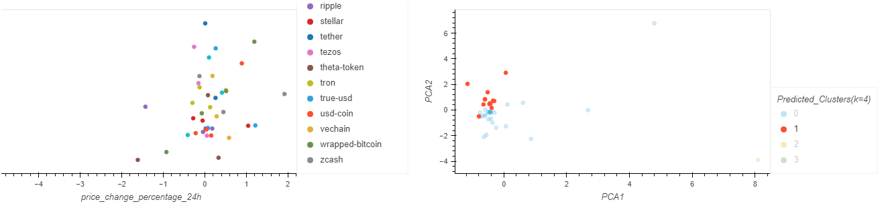

# Crypto Investments - Unsupervisied Machine Learning Performance Analysis
<!-- TABLE OF CONTENTS -->

  
Table of Contents

  <ol>
    <li>
      <a href="#purpose">Purpose</a>
      <ul>
        <li><a href="#inputs">Inputs</a></li>
        <li><a href="#outputs">Outputs</a></li>
      </ul>
    </li>
    <li>
      <a href="#technologies">Technologies</a>
      <ul>
        <li><a href="#hvplot">hvplot</a></li>
        <li><a href="#scikit-learn">scikit learn</a></li>
        <li><a href="#k-means">K Means</a></li>
        <li><a href="#pca">PCA</a></li>
        <li><a href="#standardscaler">StandardScaler</a></li>
        <li><a href="#matplotlib">Matplotlib</a></li>
      </ul>
    </li>
    <li><a href="#version-release">Version Release</a></li>
    <li><a href="#how-to-run">How to run</a></li>
    <li><a href="#usage">Usage</a></li>
    <li><a href="#contributors">Contributors</a></li>
    <li><a href="#license">License</a></li>
        <ul>
        <li><a href="#permissions">Permissions</a></li>
        <li><a href="#disclaimer">Disclaimer</a></li>
        </ul>
    </li>
    <li><a href="#aknowledgements">Aknowledgements</a></li>

---

<!--Purpose -->
## Purpose
This tool offers a novel approach to assembling Cryptocurrency based investment portfolios. The approach steers away from analyzing performance based on returns and volatility. The tool uses unsupervised machine learning to analyze clusters of Cryptocurrencies in different time periods. Analyzed data is visualized to highlight performance. 

### Inputs
The application reads price change data of crytocurrencies in different time periods.

    crypto_market_data.csv

  
### Outputs
    Analysis 1:
    - "Elbow method" algorithm is used to find the best value for k 
    - Cluster crytocurrencies by K-Means
    - Clusters optimized by Principal Component Analysis (PCA)
    Analysis 2: 
    - Best value for K using PCA data
    - Cryptocurrencies clustered with K-Means using PCA data
    Visualizations:
    - Analyzed data is plotted and visualized for to support decision making and provide comparatitive analysis. 

    
---
<!--Technologies -->
## Technologies
### Python:

    Phyton Version: **3.7.13**

## Libraries and Dependencies

### hvplot
[hvplot](https://holoviz.org/tutorial/Composing_Plots.html)

### scikit-learn
[scikit-learn](https://scikit-learn.org/stable/testimonials/testimonials.html)

### K-Means
[k-Means](https://scikit-learn.org/stable/modules/clustering.html#k-means) 

### PCA
[PCA](https://scikit-learn.org/stable/modules/generated/sklearn.decomposition.PCA.html#sklearn.decomposition.PCA)

### StandardScaler
[StandardScaler](https://scikit-learn.org/stable/modules/preprocessing.html?highlight=standard+scaler)

---
<!--How to run -->
## How to run
1. Clone the repository on a folder that will easy to open
2. File was developed with Jypiter Lab Notebook
3. Open the file with Jupiter using the Anaconda Navigator
4. Navigate open the folder where the files were cloned to
5. Open the file on JupyterLab
6. Make sure to import and install the required libaries and dependencies: 

        import pandas as pd
        import hvplot.pandas
        from pathlib import Path
        from sklearn.cluster import KMeans
        from sklearn.decomposition import PCA
        from sklearn.preprocessing import StandardScaler

---
<!--Version Release -->
## Version Release

### Version 1.0

---
<!--Usage -->
## Usage

### Visualization: K Value optimized using the Elbow Curve

### Visualization: Elbow Data Cluster:

### Visualization PCA Cluster:

### Composite Cluster Visualization:

---
<!--Contributors -->
## Contributors

Jeremy Vargas

    Managing Director
    Resonant Solutions LLC
    email:    jeremyvargas@resonantsolutions.org
    linkedin: https://www.linkedin.com/in/jeremyvargas/

UW FinTech Bootcamp
- Startup code provided by institution

---
<!--License -->
## License
Tool is available under an MIT License.

Copyright (c) 2022 - Resonant Solutions, LLC

### Permissions
Permission is hereby granted, free of charge, to any person obtaining a copy of this software and associated documentation files (the “Software”), to deal in the Software without restriction, including without limitation the rights to use, copy, modify, merge, publish, distribute, sublicense, and/or sell copies of the Software, and to permit persons to whom the Software is furnished to do so, subject to the following conditions:

The above copyright notice and this permission notice shall be included in all copies or substantial portions of the Software.
### Disclaimer
The Software is provided “as is”, without warranty of any kind, express or implied, including but not limited to the warranties of merchantability, fitness for a particular purpose and noninfringement. In no event shall the authors or copyright holders be liable for any claim, damages or other liability, whether in an action of contract, tort or otherwise, arising from, out of or in connection with the software or the use or other dealings in the Software.

---
<!--Aknowledgements -->
## Aknowledgements
* [Markdown Guide](https://www.markdownguide.org/basic-syntax/#reference-style-links)

<!-- MARKDOWN LINKS & IMAGES -->
<!-- https://www.markdownguide.org/basic-syntax/#reference-style-links -->